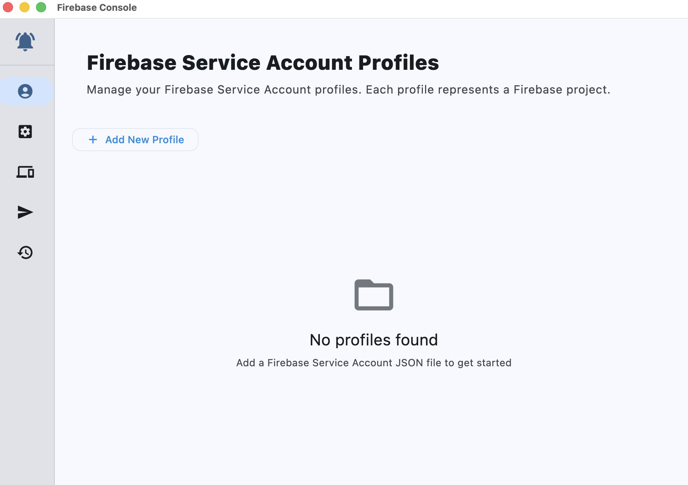
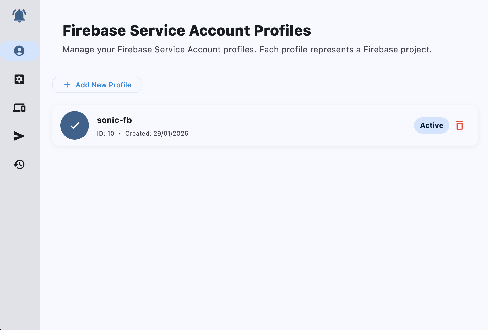
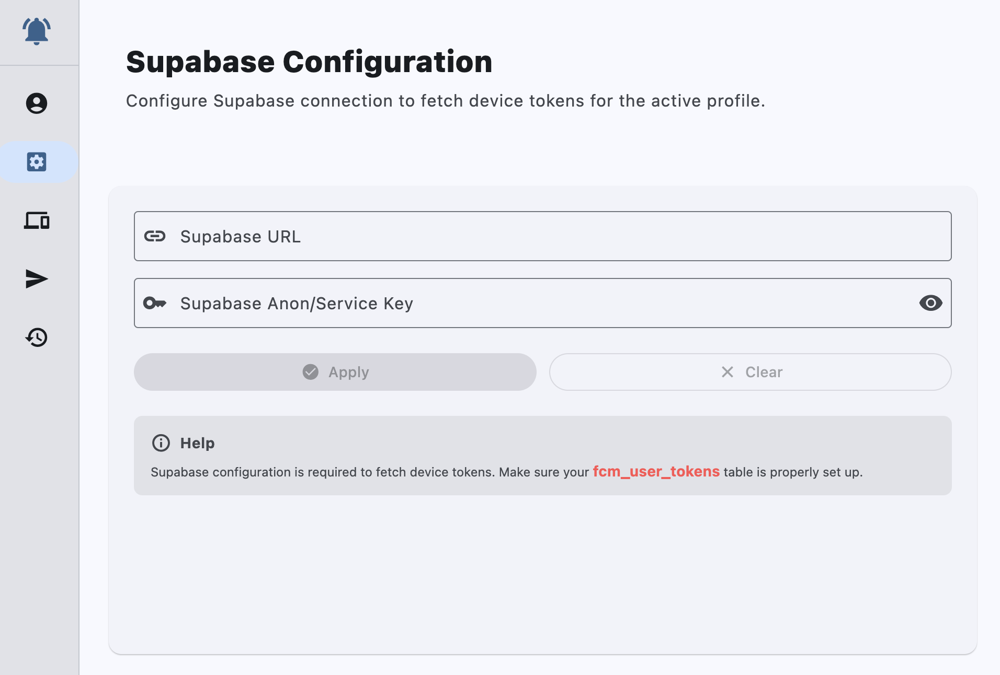
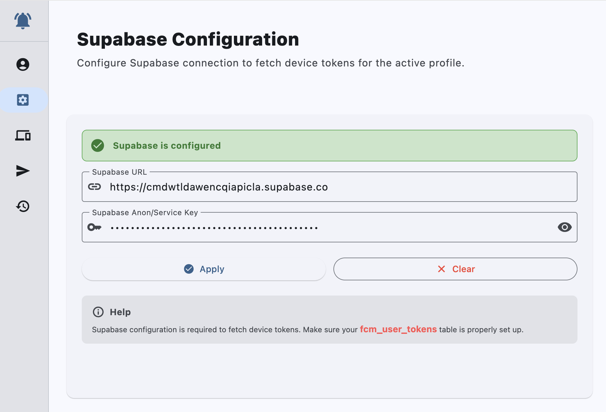
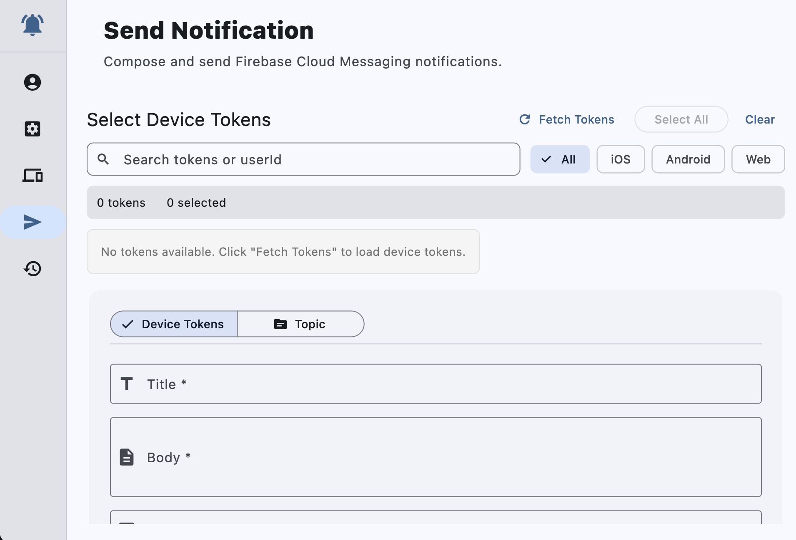
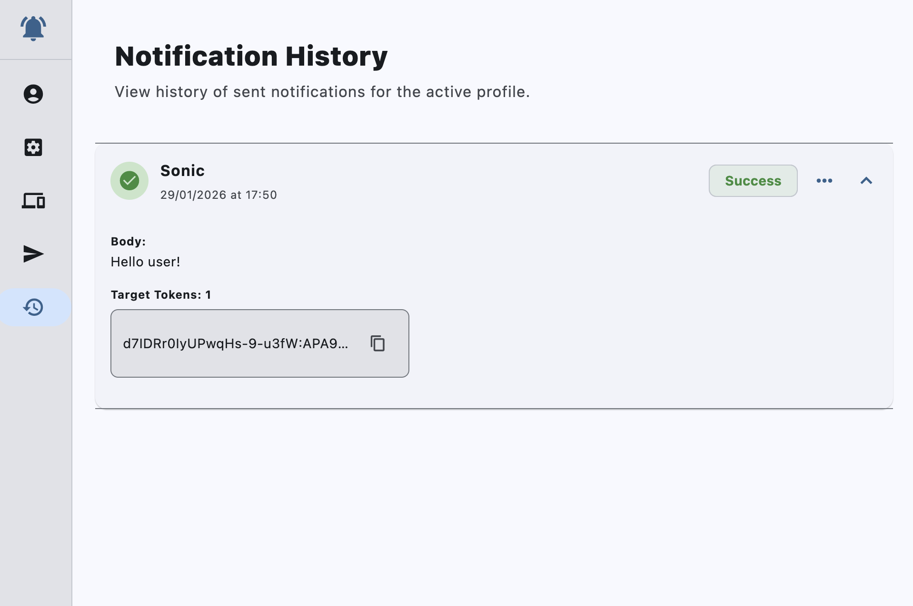

# FCM Console App

A professional desktop application for managing Firebase Cloud Messaging (FCM) push notifications, built with Flutter for Windows and macOS platforms.


## 📋 Table of Contents

- [Overview](#overview)
- [Features](#features)
- [Technology Stack](#technology-stack)
- [Prerequisites](#prerequisites)
- [Installation](#installation)
- [Building and Running](#building-and-running)
- [Project Structure](#project-structure)
- [User Guide](#user-guide)
- [Development Guidelines](#development-guidelines)
- [License](#license)

## 🎯 Overview

FCM Console App is a powerful admin tool designed to simplify the process of sending Firebase push notifications. Unlike client-side applications that receive notifications, this desktop application acts as an administrative console for sending messages to specific devices, topics, or user groups.

The application supports multiple Firebase projects through profile management, integrates with Supabase for device token management, and provides a comprehensive history of all sent notifications. It uses Firebase Cloud Messaging HTTP v1 API for secure and reliable message delivery.

## ✨ Features

### 🔐 Multi-Profile Management
- Support for multiple Firebase projects via Service Account profiles
- Easy switching between different project contexts
- Secure local storage of Service Account credentials
- Automatic context reset when switching profiles

### 🌐 Supabase Integration
- Dynamic configuration for each profile
- Fetch device tokens from remote Supabase tables
- Secure credential storage using `flutter_secure_storage`
- Real-time token synchronization

### 📤 Notification Composition
- **Single Device Mode**: Send notifications to specific device tokens
- **Multi-Device Mode**: Send to multiple selected devices at once
- **Topic Mode**: Broadcast to topic-based subscriber groups
- Rich notification payload including:
  - Title and body text
  - Image URL support
  - Custom key-value data pairs

### 📊 History & Analytics
- Complete local history of all sent notifications
- Persistent storage using SQLite database
- Search and filter capabilities
- Detailed tracking including timestamp, targets, and status

### 🎨 Professional UI/UX
- Clean, responsive Material Design 3 interface
- Adaptive layouts for various screen sizes
- Real-time status indicators
- Intuitive workflow navigation

## 🛠 Technology Stack

### Core Framework
- **Flutter 3.10.7+**: Cross-platform UI framework
- **Dart 3.10.7+**: Programming language

### State Management
- **Riverpod 2.4.9**: Reactive state management and dependency injection

### Authentication & APIs
- **googleapis_auth 1.6.0**: Google API authentication using Service Accounts
- **http 1.2.0**: HTTP client for API communication

### Database & Storage
- **sqflite_common_ffi 2.3.2**: SQLite database for local data persistence
- **flutter_secure_storage 9.0.0**: Secure storage for sensitive credentials
- **path_provider 2.1.2**: File system path access

### Supabase Integration
- **supabase_flutter 2.3.4**: Supabase client for token management

### Utilities
- **file_selector 1.0.3**: Native file picker for Service Account JSON files
- **logger 2.0.2+1**: Advanced logging capabilities
- **json_annotation 4.8.1**: JSON serialization annotations

### Development Tools
- **build_runner 2.4.8**: Code generation
- **json_serializable 6.7.1**: JSON serialization code generation
- **flutter_lints 6.0.0**: Static analysis and linting

## 📦 Prerequisites

Before you begin, ensure you have the following installed:

### For Windows
- Windows 10 or later (64-bit)
- **Flutter SDK 3.10.7 or higher**: [Download here](https://flutter.dev/docs/get-started/install/windows)
- **Visual Studio 2022** (with "Desktop development with C++" workload)
- **Git**: [Download here](https://git-scm.com/download/win)

### For macOS
- macOS 10.15 (Catalina) or later
- **Xcode 14.0 or higher**: Install from Mac App Store
- **Flutter SDK 3.10.7 or higher**: [Download here](https://flutter.dev/docs/get-started/install/macos)
- **CocoaPods**: Install via `sudo gem install cocoapods`
- **Git**: Included with Xcode Command Line Tools

### Common Requirements
- Firebase project with Service Account JSON file
- Supabase project (optional, for token management)
- Internet connection for API calls

## 🔧 Installation

### 1. Clone the Repository

```bash
git clone https://github.com/az-coder-123/fcm-console-app.git
cd fcm-console-app
```

### 2. Install Dependencies

```bash
flutter pub get
```

### 3. Generate Code (if needed)

```bash
flutter pub run build_runner build --delete-conflicting-outputs
```

### 4. Verify Flutter Setup

```bash
flutter doctor
```

Ensure all required dependencies are installed and marked with ✓.

## 🚀 Building and Running

### Windows Platform

#### Debug Mode

**Run directly from VS Code or terminal:**
```bash
flutter run -d windows
```

**Or run in debug mode with hot reload:**
```bash
flutter run -d windows --debug
```

#### Release Mode

**Build the release executable:**
```bash
flutter build windows --release
```

The executable will be located at:
```
build/windows/x64/runner/Release/fcmapp.exe
```

**Run the release build:**
```bash
./build/windows/x64/runner/Release/fcmapp.exe
```

### macOS Platform

#### Debug Mode

**Run directly from VS Code or terminal:**
```bash
flutter run -d macos
```

**Or run in debug mode with hot reload:**
```bash
flutter run -d macos --debug
```

#### Release Mode

**Build the release application:**
```bash
flutter build macos --release
```

The application bundle will be located at:
```
build/macos/Build/Products/Release/fcmapp.app
```

**Run the release build:**
```bash
open build/macos/Build/Products/Release/fcmapp.app
```

### Additional Build Options

**Profile mode for performance analysis:**
```bash
flutter build windows --profile
# or
flutter build macos --profile
```

**Split debug info for release builds (reduces app size):**
```bash
flutter build windows --release --split-debug-info=./build/windows/x64/runner/Release/symbols
```

## 📁 Project Structure

```
fcm-console-app/
├── android/                    # Android platform files
├── ios/                        # iOS platform files
├── linux/                      # Linux platform files
├── macos/                      # macOS platform files
├── windows/                    # Windows platform files
├── web/                        # Web platform files
├── lib/                        # Main application source code
│   ├── main.dart              # Application entry point
│   ├── components/            # Reusable UI components
│   │   ├── data_pairs_editor.dart          # Key-value data editor
│   │   ├── display_utils.dart              # UI display utilities
│   │   ├── notification_composer.dart      # Notification composition UI
│   │   ├── notification_form_fields.dart   # Form field components
│   │   ├── notification_history.dart       # History list component
│   │   ├── notification_send_helper.dart   # Send button helpers
│   │   ├── page_header.dart                # Page header widget
│   │   ├── profile_required_banner.dart    # Profile requirement indicator
│   │   ├── profile_selector.dart           # Profile dropdown
│   │   ├── supabase_config.dart            # Supabase configuration UI
│   │   ├── token_list.dart                 # Device token list
│   │   ├── token_selection_section.dart    # Token selection UI
│   │   ├── notification_history/          # History sub-components
│   │   └── supabase_config/               # Supabase config sub-components
│   ├── core/                  # Core utilities and constants
│   │   └── constants.dart     # Application-wide constants
│   ├── features/              # Feature modules
│   │   ├── auth/             # Authentication logic
│   │   ├── dashboard/        # Dashboard feature
│   │   └── settings/         # Settings feature
│   ├── models/               # Data models
│   │   ├── device_token.dart               # Device token model
│   │   ├── notification_history.dart        # Notification history model
│   │   └── service_account.dart             # Service account model
│   ├── providers/            # Riverpod state providers
│   │   ├── notification_form_state.dart    # Notification form state
│   │   └── providers.dart                  # Provider declarations
│   ├── repositories/         # Data repository layer
│   ├── screens/              # Screen widgets
│   │   └── dashboard_screen.dart           # Main dashboard screen
│   └── services/             # Business logic services
│       ├── database_service.dart           # Database operations
│       ├── fcm_service.dart                # FCM API integration
│       ├── storage_service.dart            # Secure storage operations
│       └── supabase_service.dart           # Supabase integration
├── docs/                     # Documentation
│   ├── APP_SPEC.md           # Application specifications
│   └── ...                   # Other documentation files
├── screenshots/              # Application screenshots
├── test/                     # Test files
├── analysis_options.yaml     # Dart analyzer configuration
├── pubspec.yaml              # Dependencies and metadata
├── README.md                 # This file
└── AGENTS.md                 # AI agent development guidelines
```

## 📖 User Guide

This section provides step-by-step instructions for using the FCM Console App, illustrated with screenshots.

### 1. Adding a New Profile

When you first launch the application, you'll need to add a Firebase Service Account profile.



**Steps:**
1. Click the "Add Profile" button on the dashboard
2. Select your Firebase Service Account JSON file using the file picker
3. The application will parse and validate the Service Account
4. Your new profile will be saved locally and displayed in the profile selector

### 2. Managing Profiles

After adding profiles, you can view and manage them from the profiles screen.



**Features:**
- View all configured Service Account profiles
- Switch between different profiles
- Delete unused profiles
- Each profile maintains its own Supabase configuration and notification history

### 3. Configuring Supabase Connection

For each profile, you can configure a Supabase connection to fetch device tokens.

**Initial State (Empty Configuration):**



**Configured State:**



**Steps:**
1. Select your profile from the dropdown
2. Enter your Supabase URL (e.g., `https://your-project.supabase.co`)
3. Enter your Supabase Anon Key or Service Role Key
4. Click "Save Configuration" to store credentials securely
5. The status indicator will show "Connected" when configuration is successful

**Note:** Credentials are stored using `flutter_secure_storage` for maximum security.

### 4. Sending Notifications

Once you have configured a profile and Supabase connection, you can send notifications.



**Steps:**
1. **Select Target Mode**:
   - **Device Tokens**: Fetch and select specific device tokens from Supabase
   - **Topic**: Enter a topic name (e.g., "news", "updates")

2. **Compose Notification**:
   - Enter the notification title
   - Enter the notification body text
   - Optionally add an image URL
   - Add custom key-value data pairs if needed

3. **Send Notification**:
   - Click the "Send Notification" button
   - The application will authenticate with Firebase using the Service Account
   - The notification will be sent via FCM HTTP v1 API
   - Status updates will be displayed in real-time

**Features:**
- Multi-select device tokens
- Real-time validation
- Error handling and user feedback
- Automatic history logging

### 5. Viewing Notification History

All sent notifications are automatically logged for future reference.



**Features:**
- View complete history of sent notifications
- Each entry includes:
  - Timestamp
  - Notification title and body
  - Target (device tokens or topic)
  - Delivery status
- Search and filter functionality
- Delete individual history entries

## 🧪 Development Guidelines

This project follows strict development guidelines to maintain code quality and consistency. Please refer to the [AGENTS.md](AGENTS.md) file for detailed guidelines:

### Key Principles
- **Clean Code**: Write clear, maintainable code following SOLID principles
- **Single Responsibility**: Each file, class, and function should have one clear purpose
- **State Management**: Use Riverpod for all state management needs
- **No Deprecated Code**: Avoid deprecated libraries and methods
- **Responsive Design**: Build adaptive UIs for various screen sizes

### Code Quality
- Run `flutter analyze` after completing any task
- Ensure no compilation or analysis errors
- Write tests for critical functionality
- Document complex logic with clear comments

### Documentation
- All documentation must be in English
- Follow professional documentation standards
- Keep README and documentation files up to date

## 🤝 Contributing

Contributions are welcome! Please follow these steps:

1. Fork the repository
2. Create a feature branch (`git checkout -b feature/amazing-feature`)
3. Commit your changes (`git commit -m 'Add amazing feature'`)
4. Push to the branch (`git push origin feature/amazing-feature`)
5. Open a Pull Request

Please ensure your code adheres to the project's coding standards and passes all lint checks.

## 📄 License

This project is licensed under the MIT License - see the LICENSE file for details.

## 🙏 Acknowledgments

- Firebase Team for the excellent FCM service
- Supabase Team for the powerful backend-as-a-service platform
- Flutter Team for the amazing cross-platform framework
- Riverpod community for the reactive state management solution

## 📞 Support

For issues, questions, or suggestions, please open an issue on the GitHub repository.

---

**Built with ❤️ using Flutter**